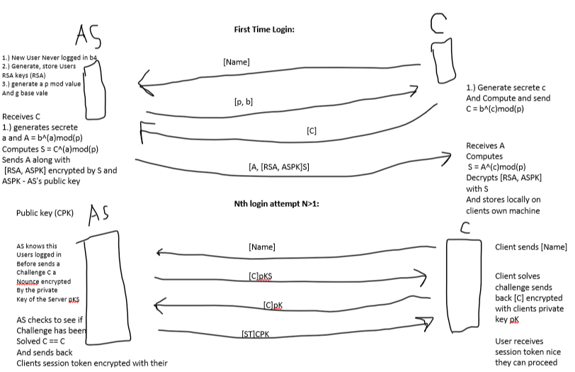

# **4.1 Mechanism Description**

## Introduction
For this phase, our team has planned and employed various cryptographic mechanisms and protcols to address the concerns of threats 1-4. The goal of these mechanisms and protocols is to ensure the security of the system by preventing unauthorized token issuance, token modification/forgery, unauthorized host servers, and information leakage via passive monitoring. In order to achieve this we have implemented techniques such as authentication protocols, digital signatures, public key infastructure (PKI) and an idea of using SSL/TLS to encrypt the data being sent between the client and server. These mechanisms and protocols will be used to ensure confidentiality, integrity, and authenticity of the data. 

### **Threat 1 -> Unauthorized Token Issuance**

**Description:** The attacker can generate a valid token without the authorization of the server. This can be done by generating a valid token and then sending it to the server. The server will then accept the token and allow the attacker to access the server. To prevent this unauthorized access we have to authenticate user/clients before issuing a token.

**Example:** An adversary gains unauthorized accesss and is able to create a valid token for a user(s). The adversary can then use this token to access the server and perform unauthorized actions based on the permissions of the user(s) associated with the token. For example, if Bob is an admin and the adversary is able to create a valid token for Bob, the adversary can then use this token to access the server and perform admin actions.

**Mechanism:** Authentication protocol

The implementation of this protocol is based on the following assumptions: 
- The first time any client connects to the authentication server the connection is secure and the client is really who they say they are. 
- Authentication servers are trusted and not compromised. 
- Users login onto the same Computer each time.
  
When ADMIN user logs in for the first time from the client the client and authentication server will perform a Diffie Hellman key exchange in order to generate a shared secret to be used for encryption temporarily. Once the shared secret has been established the CLient will send the Clients [RSAPublickey] encrypted by the shared secret
The AS will decrypt this and store the users RSA key locally on it's own machine. When a new user logs in similarly to the ADMIN client interaction the Client and AS will perform a DHKE and then the client will send the AS their [RSA Public key]encrypted by the shared secret. The AS then again will store the Clients RSA keylocally on their own machine. The client will then send a message asking for a Session Token signed by the users Private key(could be a hash of the users key too if we want). [Name, [Give me a ST]K^(-1)c]. The AS will be able to decrypt this message with it's stored Public key.

**Argument:** This mechanism ensures that through the use of RSA and Diffie-Hellman key exchange, the authentication server securely shares the keys needed and the exchange of keys is through a secure communication channel. Only authorized users with their private keys can request tokens in which the server will provide the RSA key pair and the key exchange will provide a reliable shared secret. This ensures that the token is only issued to authorized users and prevents unauthorized token issuance.

### **Threat 2 -> Token Modification/Forgery**
**Description:** The attacker can modify the token and forge a valid token. This can be done by modifying the token and then sending it to the server. The server will then accept the token and allow the attacker to access the server. To prevent this unauthorized access we have to ensure the token is not modified and is valid and if it is modified it should be rejected.

**Example:** If Bob is able to modify his token, this can lead to security breaches. For example, Bob could modify his token to give himself admin persmissions and gain access to resources he should not have access to.

**Mechanism:** Digital Signature and Token Validation from T1

The implementation of this protocol is based on the following assumptions: 
- Hard coded public key preshipped with the host server. 

To prevent token modification/forgery, we utilize digital signatures and token validation from threat 1. Any time a token is issued/created/updated by the authentication server it concatenates all of the contents in a byte array and signs them with the private key. Then the host concatenates the tokendata in a similar way and verifies that it matches what is inside the signature. This impelementation works and updates in real time. If the token is modified in any way the signature will not match and the token will be revoked.

**Argument:** This mechanism ensures that the token is not modified and is valid and if it is modified it should be rejected. This is done by using digital signatures and token validation from threat 1. The signature will guarantee the token was issued by the trusted auth server and not modified. Any attempt to modify will result in an invalid signature in which ensures the token's integrity. 

### **Threat 3 -> Unauthorized Host Servers**
**Description:** The attacker can redirect the client to a malicious host server. This can be done by redirecting the client to a malicious host server. The client will then connect to the malicious host server and the attacker can then access the client. To prevent this unauthorized access we have to ensure the client is connecting to the correct host server.

**Example:** If Bob is redirected to a malicious host server, this can lead to security breaches. For example, Bob could be redirected to a malicious host server that is not secure and the attacker can trace Bob's actions without him being aware. 

**Mechanism:** Server Authentication Protocol like PKI

The implementation of this protocol is based on the following assumptions: 
- The first time any client connects to the host server the connection is secure and the client is really who they say they are.

Initial Connection:

- When the client connects to the host server for the first time, the host server sends its public key to the client. The client will then store the servers public key locally. 
Challenge Generation and Encryption:

- To verify the authenticity of the host server, the client will generate a random challenge, we use SecureRandom to generate this. SecureRandom is a cryptographically strong random number generator (RNG). It complies with the statistical random number generator tests specified in FIPS 140-2, Security Requirements for Cryptographic Modules, section 4.9.1. This ensures that the challenge we generate is random and secure.
- The client will encrypt this challenge using the host server's public key, ensuring that only the host server can decrypt the challenge.

Challenge Response and Decryption:

- The client will then send the encrypted challenge to the host server. The host server will then decrypt the challenge using its private key.
- If the decryption is successful, the host server knows that the client possesses the host server's public key and is therefore authenticated.

Challenge Confirmation and Verification:

- The host server will generate a response (digital signature) based on the decrypted challenge. This will be sent back to the client.
- The client will receive that response from the host server and verify the response using the locally stored public key of the host server. 
- If the verification is successful the client knows they are connecting to server S and not some malicious server S'.

**Argument:** This mechanism ensures that the client connects to a legitmate host server because any attempt to redirect to a malicious server will cause a key mismatch and the verification will fail, notifying the user that they attempted to connect to a malicious server and will be disconnected for safety. 

### **Threat 4 -> Information Leakage via Passive Monitoring**

**Description:** The attacker can monitor the traffic between the client and server. Because of this the attacker will then be able to see the data being sent between the client and server. To prevent this unauthorized access we have to ensure the data being sent between the client and server is encrypted.

**Example:** If Bob is sending sensitive information to the server, this can lead to security breaches. For example, Bob could be sending his password to the server and the attacker can see this as a passive adversary and gain access to Bob's account if the data being transported is not encrypted. 

**Mechanism:** Secure Data Transmission using Diffie-Hellman Key Exchange

The following assumptions are made:
- The host server maintains a list of users and their corresponding dh key

To implement secure data transmission using Diffie-Hellman Key Exchange, we do the following: 

- A key pair is generated for each user and stored on the host server.
- The client and server use their keys to generate a shared secret.
- The shared secret represents the concept of a session key.
- Before data is transmitted, the client encrypts it using the session key.
- The encrypted data is then sent to the server and decrypted using the same session key. 

**Argument:** By using the Diffie-Hellman key exchange, we are able to establish a secure communication channel between the client and server. This helps ensure that any data being transported remains confidential and is not leaked to any passive adversaries. Since the session key or shared key is derived from the client and server's keys, only the client and server will be able to decrypt the data. This prevents any passive adversaries from gaining access to the data being transported. Finally, since the key changes each time this guarantees forward secrey and prevents any passive adversaries from decrypting the data even if they were able to gain access to the keys at a future time.

## Conclusion

In conclusion, we have implemented a multi-layered security approach to address the attacks of threats 1-4. To begin, by implementing the authentication protocol in threat 1, we ensure that only authorized users will receive valid tokens. Furthermore, in connection to this threat we also track and manage the tokens to ensure that they are not modified or forged for threat 2. This is done by using digital signatures and token validation as implemented in threat 1. Next, we implemented a PKI protocol to ensure that the client connects only to safe hosts and never redirected to any malicious servers to address the concerns of threat 3. Finally, as the program functions we want to make sure any passive adversaries are not able to monitor the traffic between the client and server. To address this, we implemented a secure data transmission protocol using Diffie-Hellman key exchange to ensure that the data being transported is encrypted and not leaked to any passive adversaries as described in threat 4.

For the design process our team followed what we learned in class and tried not to overstep any protocols that we were not familiar or confident with. Therefore, this means that there still lies risks that we might be unaware of but this is part of the learning process where we have to start small and learn more to even reach those stages of full security potential. For example, our Diffie-Hellman key exchange is currently slow and has a lot of overhead but efficieny is not a concern for now as we are still learning and trying to implement the protocols. Some ideas that did not work and we overthrew consisted of concepts that we were not as familiar with. For example, implementing the full SSL protocol was a bit too much for us as we just finished and wrapped up learning about it today (7/17). Therefore, we decided to use the Diffie-Hellman key exchange to encrypt data that was being transmitted. Overall, it was an excellent learning experience for us all and it was a huge challenge but very rewarding to reach this far. 