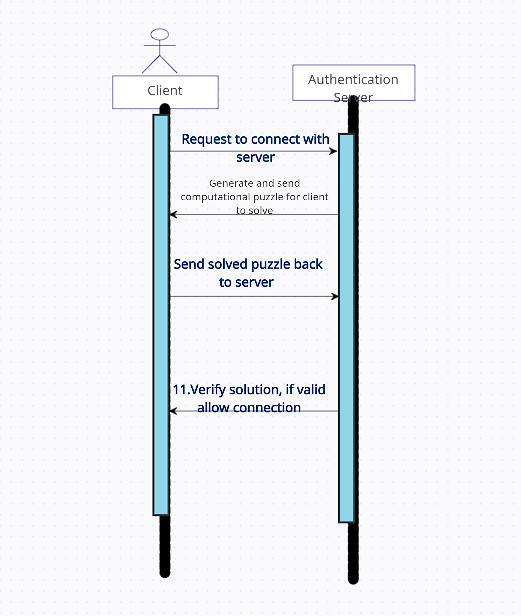

## 2.1 Threat Model

### Threat 8: Denial of Service Attack

Due to the fact that clients are untrusted, we must protect against the threat of malicious clients trying to perform a DoS attack on the server. This is important because if the authentication server is overloaded with requests from many clients at once, it will eventually be too many to handle and crash. Alice should not be able to send an overloading amount of requests to connect using a script and effectively perform a DoS service. Your implementation must ensure that the server is able to counter an overload of connections and keep the availability up and secure for legitimate users to use the system. 

## 2.2 Attack

Without any countermeasure to this threat, a malicious user Alice can for example, create a script of some sort that will send a large amount of requests to the server to connect. If Alice is able to send too many requests and there is no countermeasure, the server will eventually crash and be unavailable for other users to use. This downtime can also lead to other attacks if not carefully accounted for. 

For example, you can esentially create a script that takes in the target server and port and the number of requests you want to send. Then, you can create a for loop that will send the requests to the server. 

#!/bin/bash

for ((i=0;i<10000;i++)); do
    curl $Target_Server:$Port &
done

## 2.3 Countermeasure

For this threat, it involves adding a layer of protection using a computational puzzle to reduce the risk of a Dos Attack when an adversary is trying to sabatoge the system. The computational puzzle is a computationally difficult to solve, but easy to verify. 

Whenever the client tries to connect to the server they will be required to solve a puzzle and once that puzzle is solved the server side will verify the solution. This implementation is hard for the client but easy to verify on the server side. 

To build a computational puzzle, we will use a a hash function, H in our case SHA-256, a message m and a hardness h. To compute this the client will have to find a value x, such that H(m || x) that ends with h 0 bits. 

This is effective because it is computationally difficult to find a value x that will satisfy the hash function. However, it is easy to verify the solution by checking if the hash function ends with h 0 bits. The client will have to brute force and search for a value x that will satisfy our requirements. Therefore it takes O(2^h) time to solve the puzzle. But yet, it only takes 1 hash computation to verify the solution for the server. 

Therefore, if the client sends an overload of requests to the server they will have to solve a puzzle for each request and this will essentially counter attack them and slown themselves down instead of the server. 

## Extra Credit

For extra credit we discovered a bug where a user is able to delete the last admin in the admingroup. If this happens it renders the service 
useless because there is no admin to add other users to the admingroup. In order to fix this we added a check into the delete group method that checks to see if the username that user is trying to delete is the last admin in the admingroup. If it is the last admin, the user will not be able to delete that user. 

#### References:
Lecture 19 Professor Khattab